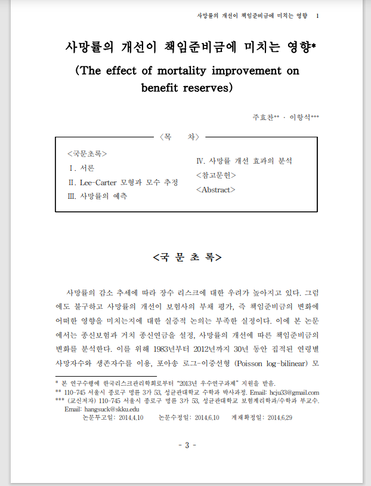
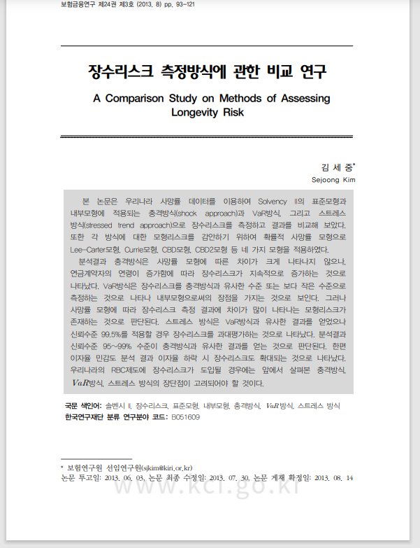
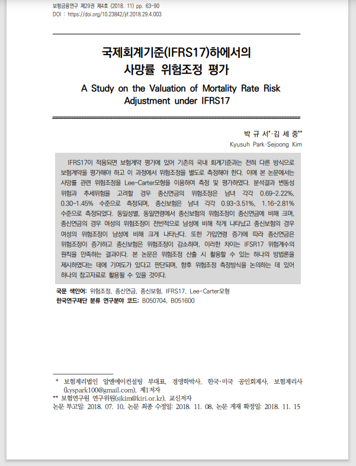
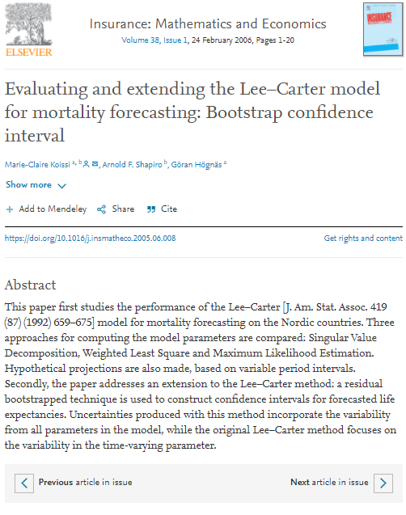

### 서론

LC모델에 관한 계수 추정 방법은 지난 9월 24일 1차 발표를 통해 충분히 이해할 수 있었다. 2차 발표는 논문의 결과값을 산출하는 것인데 LC모델의 경우 R패키지로 어렵지 않게 구현할 수 있기 때문에 사망률 예측을 통한 보험부채 산출은 큰 의미가 없어 보인다. 그렇기에 LC 모델을 활용해 사망률의 위험조정을 산출하는 2번째 논문으로 이어가는 것으로 가닥을 잡게 되었다. 발표일은 11월 3일 수요일로 대학원에서의 마지막 발표에 해당한다. 지난 대학원 석사 2학기에 해지율 시나리오 산출과 관련된 논문을 통해 헐-화이트 모델을 통한 해지율 시나리오를 산출해 보았고 지급준비금에 관하여서는 석사학위논문 작성을 통해 지급준비금의 예측분포 산출을 하므로 지급준비금과 관련된 위험조정금액 산출을 실습해보았다. 잔차를 활용한 부트스트랩 방법과 베이지안 모델을 활용한 MCMC기법을 모두 사용하였는데, 사망률 시나리오 산출에도 이러한 방법론이 동일하게 사용된다. 

### 방법

먼저는 LC모델을 명확하게 이해해야한다. 1차 발표 논문인 "사망률 개선이 책임준비금에 미치는 영향"을 통해 LC모델의 모수 $\alpha_{x}$와 $\beta_{x}$ 그리고 $k_{t}$ 추정과 예측을 알 수 있다. 두번째로 LC모델을 활용하여 사망률 시나리오를 산출해야하는데 2013년 논문인 김세중 "장수리스크 측정방식에 관한 비교 연구"를 활용할 수 있다. 이 논문에서는 Koissi 2006년 논문을 활용하는데 여기에서 실제 데이터를 활용한 사망자수 $D_{s,t}$와 LC 모델을 통해 추정한 $\hat{D}_{s,t}$에 관한 피어슨 잔차를 구하고 이를 복원 추출하여 가상의 사망자수 데이터 셋을 여러개 만들어낸다. 이를 통해 가상의 사망자 수 데이터를 LC모델에 재적합시켜 $\alpha_{x}$와 $\beta_{x}$ 그리고 $k_{t}$를 추정할 수 있고 이를 바탕으로 사망률 시나리오를 여러개 만들어 낼 수 있다.

### 추세 위험과 변동성 위험

사망률에 관하여서 3가지 위험이 존재한다. 수준위험, 추세위험, 변동성위험. 수준위험의 경우 사망률 추정 대상의 차이로 인해 두 집단 사망률의 전반적인 수준에 차이가 나타나면서 발생하는 위험이다. 예를 들어, 국민 경험생명표와 보험회사의 보험계약 가입자 데이터를 활용한 경험사망률간의 차이를 들 수 있고 보험회사가 보험계약 가입자 데이터를 활용하지않고 국민경험생명표를 활용할 경우 직면 할 수 있는 위험이 수준 위험이다. 추세위험의 경우 보험부채의 최선추정치 계산에 사용된 미래 사망률 추세의 불확실성에 의해 발생한다. 미래 사망률 개선 추세는 주로 과거 개선추세를 반영하여 예측하며, 실현된 사망률 개선이 예측된 추세를 벗어나는 경우 보험회사는 지속적인 손실에 직면할 수 있다. LC모형에서 $k_{t+1} = k_{t} + \lambda + \epsilon_{t}$ 식에서 추세위험을 유발하는 것은 $\lambda$의 불확실성이다. 변동성리스크의 경우는 예측오차 $\epsilon_{t}$의 표준편차 $\sigma_{t}$가 유발요인이다.

### 위험조정산출

사망률 시나리오를 여러개 생성한 뒤 이를 이용해 보험상품의 부채를 구하게 되면 시나리오 만큼의 보험부채가 생성되고 이를 통해 보험부채의 경험적 분포를 구할 수 있고 평균금액과 VAR를 활용하면 위험조정금액을 산출할 수 있다. 추세 위험만을 반영하려면 잔차 부트스트랩기법을 활용하여 가상 사망자 수 데이터 셋을 만들어 LC모형에 재적합 시킨 뒤 미래 사망률의 기대값을 산출하여 사용하면 되고 변동성위험까지 모두 반영하려면 재적합 시킨 뒤 $k^{i}_{t}$를 표류항(drift)로 갖는 임의보행 모형으로 모형화한 후 미래 사망률 시나리오를 생성하면 된다.

```{r, echo=FALSE, fig.cap='논문들', out.width = '30%', fig.ncol=2, fig.align='center'}




```

