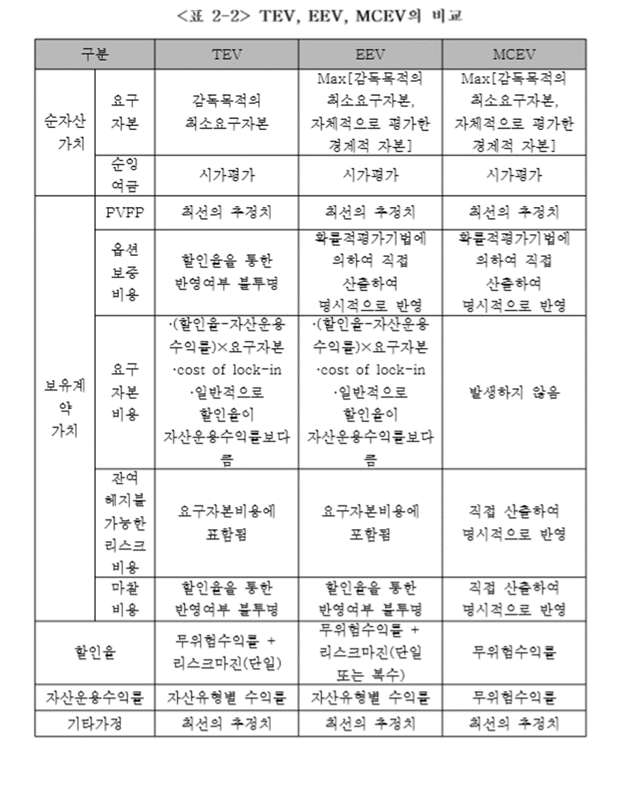

### 서론

장기 계약을 보유하고 있는 보험사들의 특성상, PBR이나 ROA와 같은 지표를 통한 보험사 가치 평가에는 한계가 있다. 이러한 점에서 일반적인 금융회사와 다르게 보험사들은 내재가치(embedded value)를 가치평가 지표로 이용하고 있다. 특히 내재가치 공시의 핵심으로서 1년간의 EV 변동성 분석은 전통적인 손익계산서를 대신하여 보험회사의 평가기간 내의 경영 실적을 보다 명확하게 나타내는 경영기법으로서 업계에서 사용되고 있다. EV 변동성 분석은 전기의 가치와 당기의 가치 차이를 다양한 요소로 분해하여 보여주는 것이다. 당기 가치와 전기가치의 차이를 내재가치이익(RoEV) 라고 하며 신계약가치, 경험실적 차이, 가정변경 효과 등의 구성요소로 이루어진다.

### EV의 역사

최초의 내재가치 개념은 1959년 Jame Anderson의 논문에서 유래되었으며, 이후 유럽에서는 상장보험사의 평가를 위하여 전통적인 재무제표와는 별도로 내재가치 분석보고서의 공시에 대한 가이드 라인을 제시하여 내재가치를 공시하고 있으며 세계적인 보험사들이 IPO, M&A을 진행 할 때 사용되는 기준으로 회사 내부 성과 및 전략 지표로도 사용되고 있다.

### EV산출 방법

TEV(Traditional Embedded Value), EEV(European Embedded Value), MCEV(Market Consistent Embedded Value)방법이 있다.

#### TEV

전통적 내재가치란 대상계약에 할당된 자산으로부터 발생되는 장래 배당 가능한 이익 중 주주 몫에 대한 현재가치를 의미하며 그 구성요소로는 조정순자산가치(ANW)와 보유계약가치(VIF)로 표현

TEV = VIF + ANW = PVFP – CoC + RC + FS
VIF : 보유계약에서 발생하는 미래수익의 현재 가치(PVFP) – 자본비용(CoC)
ANW : 조정순자산가치란 순잉여금(Free surplus)가치와 요구자본(required capital)가치를 의미
이는 장부상 자기자본에서 준비금, 무형자산가치 등을 조정하여 계산된다.
조정항목으로는 합산항목 (배당 보험손실보전준비금,대손충당금, 비상위험 준비금) 차감항목 (영업권 등 무형자산, 선급비용, 지급 에정된 현금배당액)
순잉여금가치는 평가일 현재 보유계약에 할당되었지만 즉각적인 환입에 어떠한 제약도 없는 자본과 잉여금의 시장가치를 의미한다.
요구자본가치란 대상계약에 할당된 자산 중 부채초과 자산으로 주주에 대한 배분이 법적 혹은 내부적 요구에 의해 제한되는 자산을 의미한다.

내재가치 결과는 장래 현금흐름 산출을 위해 사용된 가정들에 많이 좌우되는데 주요 가정으로는 경제적 가정과 계리적 가정이 있다. 
경제적 가정: 투자수익률, 시장금리, RDR, 기대 배당률, 인플레이션 
계리적 가정: 각종 위험률, 해약률, 사업비율, 계약자 행동등

#### EEV

내재가치 측정에관한 통일된 기준 마련과 리스크를 감안한 내재가치 측정 방법에 대한 필요성에 의해 CFO 포럼에서 유럽형 내재가치(EEV) 측정방법에 대한 기준을 마련하였다.
EEV = TEV – FOG 비용

FOG 비용 = 금융옵션과 보증 비용
확률론적 현금흐름분석을 통하여 옵션과 보증 가치를 산출하고 이를 명시적으로 반영

#### MCEV

VIF +ANW – FOG 비용 – FC(frictional costs) –CNHR(cost of non-hedgeable risks)


FC : 요구 자본비용을 마찰 비용으로 칭하며 주주의 보험회사에 대한 투자로 인하여 발생하는 관련 비용으로 요구자본을 지원하고 있는 자산의 투자소득에 대한 세금과 투자관리비용을 의미

CNHR : 보험계약부채에서 발생하는 현금흐름은 시장을 통하여 헤지가 불가능하므로 해지불가능한 리스크 비용은 부채 현금흐름의 불확실성에서 발생하며, 동 비용은 회사의 재량에 의해 다양한 방법을 이용하여 산출

```{r, echo=FALSE, fig.cap='참고논문의 표', out.width = '30%', fig.ncol=2, fig.align='center'}

```


#### 참고 논문

유광욱,” 생명보험회사의 내재가치 변동성분석에 관한 연구 -경험실적차이를 중심으로-”, 한양대학교 일반대학원 석사학위논문, 2012


